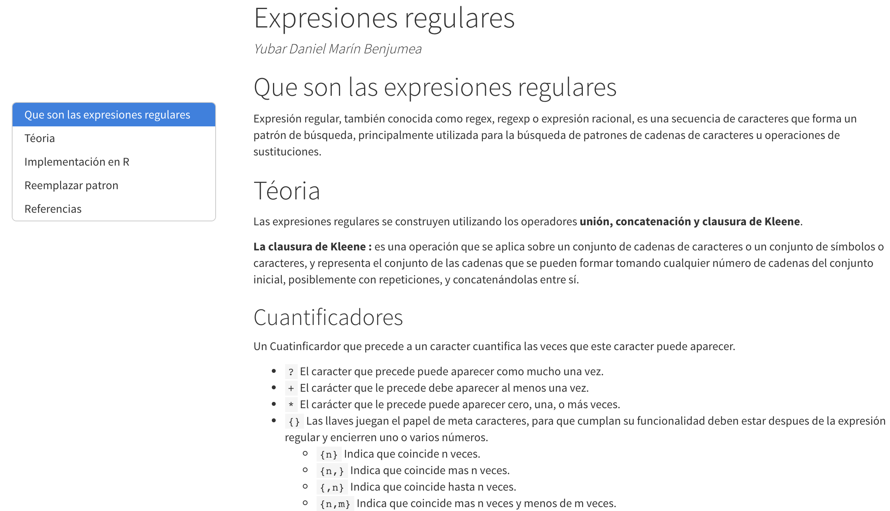
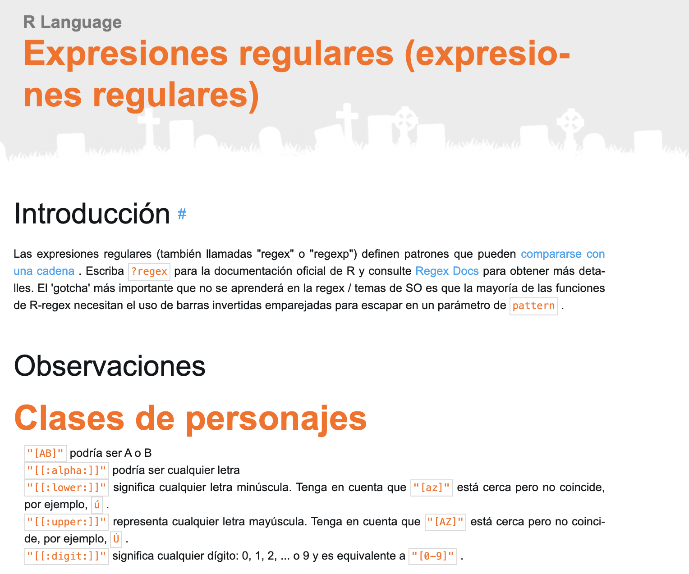
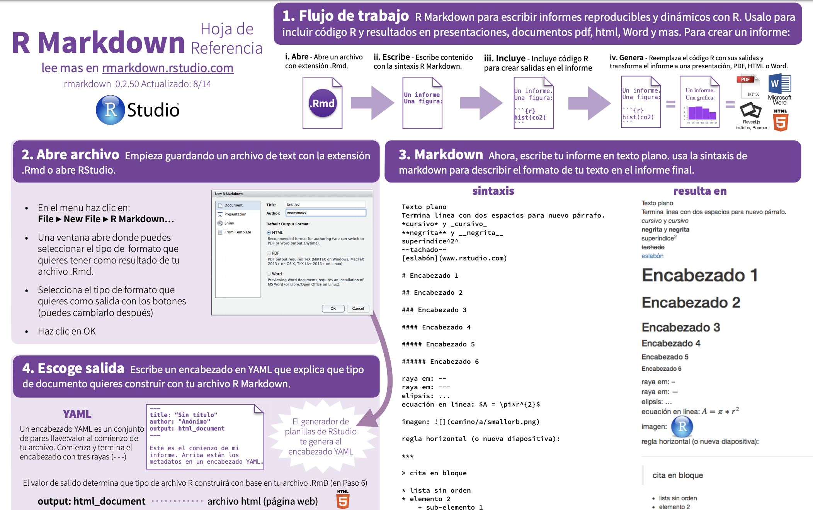
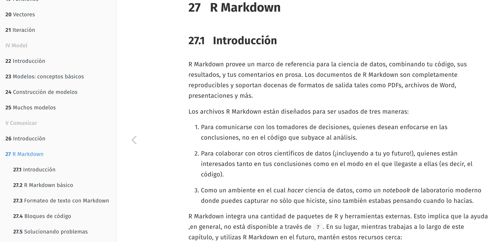

```{r setup, include=FALSE}
knitr::opts_chunk$set(echo = TRUE)
```

## Curso de iniciación a R

### 0. Contenido

1. Dos recursos sobre expresiones regulares discutidas (cuál es mejor, cuál es peor, por qué).
1. Dos recursos sobre markdown y discutidas como en el punto anterior.
1. Carga, estudio y representación gráfica de unos datos de tu elección.

- Un gráfico generado con `ggplot2`. Que use facetas +5%
- Una tabla. Paquete para crear tablas +10%

### 1. Expresiones Regulares {.tabset .tabset-pills}

Expresión regular, también conocida como _regex_, _regexp_ o expresión racional, es una secuencia de caracteres que forma un patrón de búsqueda, principalmente utilizada para la búsqueda de patrones de cadenas de caracteres u operaciones de sustituciones.

A continuación, compararemos dos páginas de recursos para su aprendizaje que se pueden encontrar en Internet, destacando los pros y los contras de ambas.


#### 1.1. RPubs

[RPubs](http://rpubs.com/ydmarinb/429756)

<center>{width=70%}</center>
<div/>

- Contenido:
- Código:
- Estética: Armoniosa y clara. Con un patrón lógico.

CONCLUSIÓN:


#### 1.2. Riptutorial

[Riptutorial](https://riptutorial.com/es/r/topic/5748/expresiones-regulares--expresiones-regulares-)

<center>{width=70%}</center>
<div/>


- Contenido: Escaso y poco claro. Destaca las cuestiones teóricas básicas, sin poner ejemplos de ello. Para un usuario que se está iniciando con este lenguaje resulta complicado su comprendimiento y aplicación práctica.
- Código: Limitado. Más allá de enlace a otras páginas web y cambio de color sin un patrón o lógica claros, no existe un código formulado de cierta complejidad.
- Estética: Estresante. No cumple la normativa ortotipográfica ya que, tiene un color destacado y un tamaño de fuente mayor los subtítulos dentro de las secciones:

CONCLUSIÓN: El nombre de la página (RIP tutorial) es un buen indicativo de la calidad instructiva del mismo. En mi opinión, llamarle tutorial es excederse.


### 2. R Markdown {.tabset .tabset-pills}

R Markdown es un formato que permite una fácil creación de documentos, presentaciones dinámicas y informes de R. Markdown es un formato de sintaxis simple para crear documentos en HTML, PDF, y Word.

A continuación, siguiendo con el mismo patrón que en el punto anterior, compararemos dos páginas de recursos para su aprendizaje que se pueden encontrar en Internet por su contenido, código y estética. 

En base a dichos puntos, concluiremos cuál es mejor y cuál peor para formarse y crear buenos documentos en formato R Markdown.

#### 2.1. Rstudio

[Rstudio.com](https://rstudio.com/wp-content/uploads/2015/03/rmarkdown-spanish.pdf)

<center>{width=70%}</center>
<div/>

- Contenido: Conciso y claro. Indicando 
- Código: Ejecución correcta.
- Estética: Coherente. Estéticamente agradable, deja claro cómo se ve en un documento Markdown el código descrito

CONCLUSIÓN: Muy buen recurso para, de un vistazo, poder saber lo básico que alcanza un documento RMarkdown.


#### 2.2. R4ds

[r4ds](https://es.r4ds.hadley.nz/r-markdown.html)

<center>{width=70%}</center>
<div/>


- Contenido:
- Código:
- Estética: 

CONCLUSIÓN:


### 3. ChickWeight: estudio básico

A continuación, trabajaremos el conjunto de datos `ChickWeight` que estudia el efecto de diferentes dietas en el peso de los pollitos del muestreo siguiendo la evolución del peso según la edad.

Las diferentes variables recogidas en dicho _dataset_ son las siguientes:

```{r echo=FALSE}

colnames(ChickWeight) 

```

Donde:

1. Weigth: Es el peso del pollito, en valor numérico
1. Time: Edad, en días ,del pollito
1. Chick: Pollito, ordenado numéricamente como factor
1. Diet: Tipo de dieta que ha llevado el pollito, representado 1-4 como factor

Un fragmento de dichos datos los podemos ver reflejados en la siguiente tabla:

```{r echo=FALSE}

library(knitr)

pollitos <- ChickWeight

dieta1 <- pollitos[pollitos$Diet == 1,]

kable(dieta1
      , caption = "Pollitos alimentados con la Dieta1"
      , align = c('c', 'c', 'c', 'c')
      , col.names = c("Peso","Edad","Pollito", "Dieta")
      , row.names = TRUE
      , digits = 1
      , format.args = list( decimal.mark = ",")
)


```

```{r}
summary(ChickWeight$Diet)
```

<center>
```{r echo=FALSE}

pollitos <- ChickWeight

library(ggplot2)

polluelos <- ggplot(data = pollitos, 
       aes(x = Time, y = weight, colour = Diet)) +
       geom_point() +
       geom_smooth(method = "lm") + 
       facet_wrap(~Diet, ncol = 2) +
       scale_y_continuous(position = "right") + 
       labs(x = "Días", y = "Peso (gr)")

polluelos2 <- polluelos + ggtitle("Aumento de peso según las diferentes dietas")

library(ggthemes)

polluelos2 + theme_economist(base_size = 10, base_family = "sans", horizontal = TRUE,
                dkpanel = FALSE) + scale_color_economist()
```
</center>
<div/>